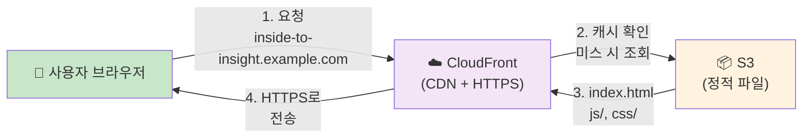
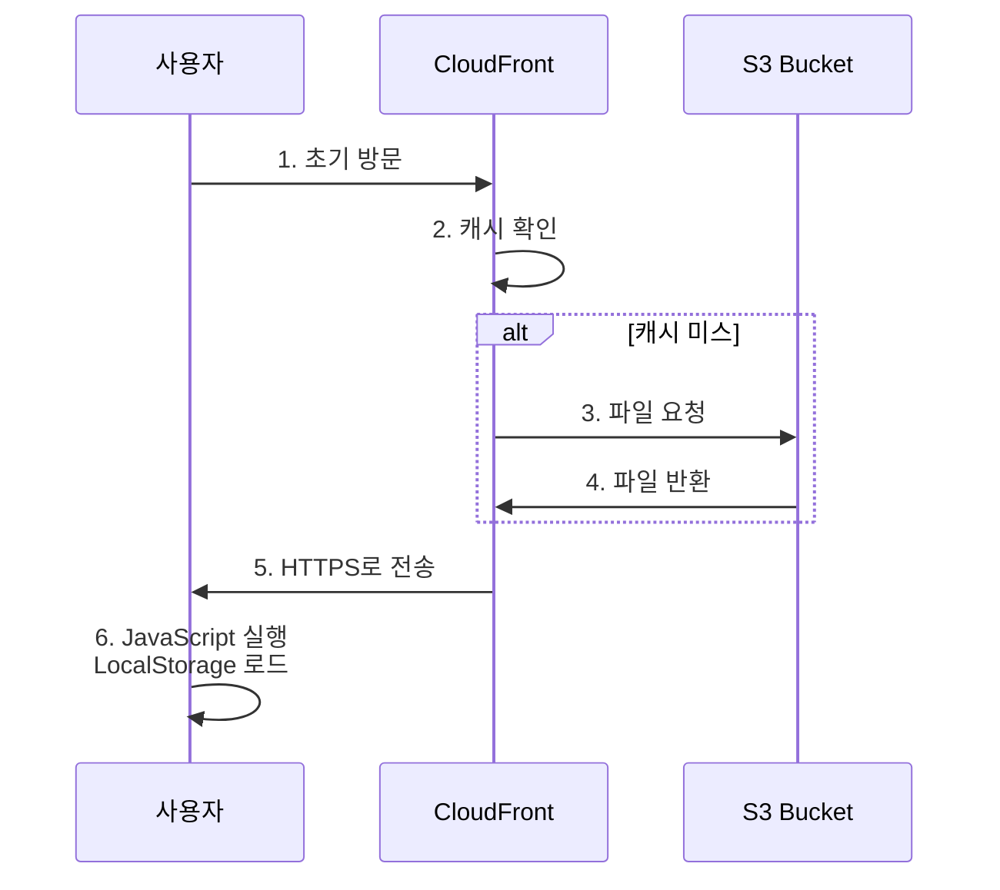
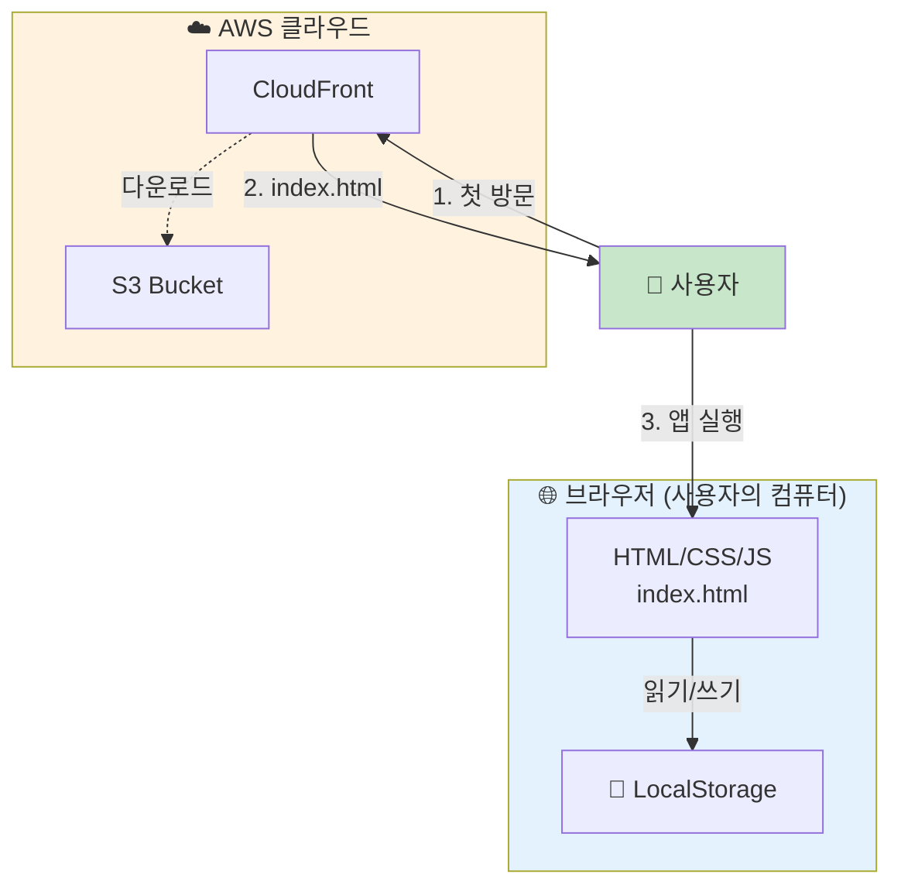

# InsideToInsight AWS MVP 아키텍처 설계

## 1. 개발 환경 vs 배포 환경 구분

### 현재 개발 환경 🔧
- **위치**: AWS EC2 인스턴스
- **목적**: 애플리케이션 개발 및 코드 작성
- **실행 방식**: 로컬 개발 서버 (예: `python -m http.server`)
- **접근**: EC2 보안 그룹을 통한 제한된 접근

### 최종 배포 환경 🚀
- **위치**: AWS S3 + CloudFront
- **목적**: 실제 사용자가 접근하는 프로덕션 환경
- **실행 방식**: 글로벌 HTTP/HTTPS 배포
- **접근**: 인터넷의 누구나 접근 가능

---

## 2. 현재 프로젝트 분석

### 2.1 애플리케이션의 실제 구현

**Frontend 구조**:
```
index.html (진입점)
├── css/main.css (스타일)
└── js/ (모든 로직)
    ├── app.js (메인 애플리케이션)
    ├── state.js (상태 관리)
    ├── utils.js (유틸리티)
    ├── data/example-data.js (샘플 데이터)
    └── features/ (기능 모듈)
        ├── render.js (UI 렌더링)
        ├── mindmap.js (마인드맵)
        └── insight.js (Insight 생성)
```

**데이터 흐름**:
- 모든 다이어리 데이터는 **사용자 브라우저의 LocalStorage에만 저장**
- 서버에 데이터를 전송하거나 저장하지 않음
- 같은 브라우저, 같은 기기에서만 데이터 접근 가능

**실행 방식**:
- 모든 로직이 **클라이언트 JavaScript**에서 실행
- 다이어리 작성/수정/조회: 브라우저에서만 발생
- Insight 프롬프트 생성: 클라이언트 JS에서만 실행
- 외부 API 호출 없음: AI는 생성된 프롬프트를 외부에서 수동으로 처리

### 2.2 Backend/Database 필요성 검토

| 항목 | 현재 구현 | Backend 필요? |
|------|---------|------------|
| **데이터 저장** | LocalStorage (브라우저) | ❌ 불필요 |
| **사용자 인증** | 없음 (프라이빗 앱) | ❌ 불필요 |
| **API 통신** | 없음 | ❌ 불필요 |
| **Insight 분석** | 클라이언트 JS | ❌ 불필요 |
| **AI 호출** | 없음 (수동 처리) | ❌ 불필요 |

**결론**: Backend와 Database는 현재 MVP 단계에서 **필요하지 않음**.

---

## 3. 최종 선택 아키텍처

### 3.1 MVP 아키텍처 선택 기준

현재 프로젝트의 특성상, 다음 기준으로 최적의 아키텍처를 선택했습니다:

1. **정적 파일만 필요** → **S3 호스팅** 선택
2. **글로벌 접근 필요** → **CloudFront CDN** 추가
3. **Backend 로직 없음** → Backend 제외
4. **사용자 데이터 LocalStorage 저장** → Database 제외
5. **최소 비용, 최소 복잡성** 우선

### 3.2 선택된 AWS 서비스

```
사용자 브라우저 (사용자의 컴퓨터)
        ↓
CloudFront (AWS CDN - HTTPS 제공, 글로벌 캐시)
        ↓
S3 (정적 파일 저장: HTML, CSS, JS)
```

| 서비스 | 역할 | 이유 |
|--------|------|------|
| **S3** | 정적 파일 호스팅 | HTML/CSS/JS 파일만 필요, DB 불필요 |
| **CloudFront** | 글로벌 CDN, HTTPS | 전 세계 사용자 접근, 보안 필요 |
| **Route 53** (선택사항) | 도메인 관리 | 커스텀 도메인 사용 시만 필요 |

---

## 4. AWS 리전

**Region**: `us-east-1` (N. Virginia)

선택 이유:
- 가장 많은 AWS 서비스와 기능 지원
- 일반적으로 가장 저렴한 가격대
- 글로벌 CDN(CloudFront) 성능 최적화

---

## 5. 아키텍처 다이어그램

### 5.1 최종 MVP 아키텍처 (배포 환경)



### 5.2 요청 흐름 (상세)



### 5.3 데이터 흐름 (사용자 관점)



---

## 6. Frontend / Backend / Database 구조

### 6.1 현재 MVP 구조

```
┌─────────────────────────────────────────────────┐
│          Frontend (S3 + CloudFront)             │
│  ┌───────────────────────────────────────────┐  │
│  │  HTML/CSS/Vanilla JavaScript              │  │
│  │  • 마인드맵, 카드, 타임라인 렌더링        │  │
│  │  • 다이어리 입력/조회/필터링               │  │
│  │  • Insight 프롬프트 생성                   │  │
│  └───────────────────────────────────────────┘  │
│  ┌───────────────────────────────────────────┐  │
│  │  LocalStorage (사용자 브라우저)           │  │
│  │  • 개인 다이어리 데이터만 저장            │  │
│  │  • 서버 전송 없음 (프라이빗)              │  │
│  └───────────────────────────────────────────┘  │
└─────────────────────────────────────────────────┘

Backend: ❌ 없음 (필요 없음)
Database: ❌ 없음 (LocalStorage로 충분)
```

### 6.2 향후 확장 시 구조 (참고용)

만약 나중에 멀티 디바이스 동기화가 필요하면:

```
Frontend (S3 + CloudFront)
    ↓ HTTPS API 호출
Backend (Lambda + API Gateway)
    ↓ SQL Query
Database (RDS PostgreSQL)
```

---

## 7. 각 서비스의 역할

### 7.1 S3 (Simple Storage Service)

**역할**: 정적 웹사이트 파일 호스팅

**배포되는 파일**:
```
inside-to-insight-prod/ (S3 버킷)
├── index.html
├── css/
│   └── main.css
└── js/
    ├── app.js
    ├── state.js
    ├── utils.js
    ├── data/example-data.js
    └── features/
        ├── render.js
        ├── mindmap.js
        └── insight.js
```

**설정 (실제 배포 시)**:
- 정적 웹사이트 호스팅 활성화
- 인덱스 문서: `index.html`
- 공개 액세스: CloudFront를 통해서만 접근 (직접 S3 접근 차단)
- CORS: 현재 필요 없음

**데이터 저장**: ❌ S3에 사용자 데이터 저장 안 함 (LocalStorage만 사용)

### 7.2 CloudFront (Content Delivery Network)

**역할**: 글로벌 배포, HTTPS 제공, 캐싱

**기능**:
- S3의 정적 파일을 전 세계 엣지 로케이션에 캐시
- **자동 HTTPS** (AWS Certificate Manager 인증서)
- 빠른 다운로드 속도 제공
- 지연 시간 감소

**캐시 전략 (실제 배포 시 권장)**:
- `index.html`: 5분 TTL (자주 업데이트 가능)
- `js/`, `css/`: 1년 TTL (파일 해시 기반 버전 관리)

**비용**: 데이터 전송량에 따라 가변 (월 1GB 미만 시 매우 저렴)

### 7.3 Route 53 (DNS - 선택사항)

**역할**: 도메인 관리

**사용 시나리오**:
- `inside-to-insight.example.com` 같은 커스텀 도메인 사용
- AWS의 도메인 등록 및 DNS 관리 (또는 외부 DNS 서비스 사용 가능)

**현재**: 필수 아님, CloudFront 기본 도메인으로도 배포 가능

---

## 8. 요청 흐름 (Request Flow)

### 8.1 초기 방문 (First Visit)

```
1. 사용자가 HTTPS로 접속
   https://inside-to-insight.example.com

2. CloudFront가 요청 수신
   → 캐시 확인 (처음이므로 캐시 미스)

3. CloudFront가 S3에서 파일 요청
   → index.html 다운로드

4. CloudFront가 CloudFront 엣지 로케이션에 캐시

5. 브라우저가 index.html 수신
   → 포함된 CSS, JS 파일 다운로드

6. 브라우저가 JavaScript 실행
   → LocalStorage에서 기존 데이터 복원 (있으면)
   → UI 렌더링 완료
```

### 8.2 재방문 (Cached Visit)

```
1. 사용자가 다시 접속

2. CloudFront 캐시에서 index.html 반환
   (TTL 5분 이내일 경우)

3. 브라우저가 즉시 페이지 로드
   (네트워크 요청 최소화)

4. JavaScript 실행 & LocalStorage 로드
```

### 8.3 사용자 동작 (User Action - 서버 없음)

```
1. 사용자가 다이어리 작성 후 "저장" 클릭

2. JavaScript에서 상태 업데이트
   → 메모리에만 변경사항 저장

3. LocalStorage에 JSON 직렬화하여 저장
   → 브라우저 로컬 스토리지 (서버 아님)

4. 다음 방문 시 LocalStorage 복원
   → 변경사항 유지

5. 서버로의 데이터 전송: ❌ 없음
   (모든 데이터가 로컬에만 존재)
```

---

## 9. 데이터 흐름 (Data Flow)

### 9.1 다이어리 기록 저장

```
사용자 입력
  ↓
JavaScript (app.js)
  ├─ 상태 객체 생성
  └─ I2IState.save(state)
    ↓
LocalStorage
  ├─ JSON 직렬화
  └─ 브라우저에만 저장 (서버 ❌)
```

### 9.2 다이어리 조회

```
브라우저 로드
  ↓
JavaScript (app.js)
  └─ I2IState.load()
    ↓
LocalStorage
  └─ JSON 복원
    ↓
UI 렌더링 (render.js)
  ├─ 마인드맵 표시
  ├─ 카드 뷰 표시
  └─ 타임라인 표시
```

### 9.3 Insight 프롬프트 생성

```
사용자가 질문 입력
  ↓
JavaScript (insight.js)
  ├─ LocalStorage에서 모든 다이어리 로드
  ├─ 카테고리별/날짜순 정렬
  └─ 프롬프트 텍스트 생성
    ↓
프롬프트 표시 (모달)
  ├─ 복사 버튼 (clipboard)
  └─ 다운로드 버튼 (파일)
    ↓
사용자가 외부에서 수동으로 처리
  ├─ ChatGPT, Claude, 등에 붙여넣기
  └─ AI 응답 확인
```

**중요**: 서버와의 통신 없음. 모든 처리가 로컬에서 발생.

---

## 10. 서비스 선택 이유

### 10.1 S3 + CloudFront를 선택한 이유

| 기준 | S3 + CloudFront | EC2 | Lambda |
|------|-----------------|-----|--------|
| **복잡도** | ⭐ 매우 단순 | ⭐⭐⭐ 복잡 | ⭐⭐ 보통 |
| **비용** | ⭐ 저가 | ⭐⭐⭐ 중상 | ⭐ 저가 (트래픽 적을 때) |
| **관리** | ⭐ 거의 없음 | ⭐⭐⭐ 많음 | ⭐⭐ 보통 |
| **확장성** | ⭐⭐ 제한 | ⭐⭐⭐ 우수 | ⭐⭐ 보통 |
| **MVP 적합도** | ⭐⭐⭐ 최고 | ⭐ 과설계 | ⭐⭐ 가능 |

**선택 이유**:
1. 정적 파일만 필요 → S3로 충분
2. 글로벌 접근 필요 → CloudFront 최적
3. 관리 복잡성 최소 → 서버 관리 불필요
4. 비용 최소 → 저트래픽에 매우 저렴
5. MVP 구현에 최적 → 빠른 배포 가능

### 10.2 Backend를 제외한 이유

| 항목 | 필요? | 이유 |
|------|------|------|
| **사용자 로그인** | ❌ 불필요 | 프라이빗 앱, 인증 없음 |
| **다이어리 저장** | ❌ 불필요 | LocalStorage로 충분 |
| **데이터 동기화** | ❌ MVP 단계에서 불필요 | 향후 필요 시 추가 가능 |
| **AI Insight** | ❌ 불필요 | 클라이언트 JS로 프롬프트만 생성 |
| **API** | ❌ 불필요 | 서버 통신 없음 |

**결론**: Backend를 추가하면 비용/복잡성만 증가하고 이득이 없음.

### 10.3 Database를 제외한 이유

| 항목 | 필요? | 이유 |
|------|------|------|
| **데이터 저장** | ❌ 불필요 | LocalStorage로 충분 |
| **멀티 디바이스** | ❌ MVP 단계에서 불필요 | 향후 필요 시 RDS 추가 |
| **사용자 관리** | ❌ 불필요 | 프라이빗 앱 |
| **복잡한 쿼리** | ❌ 불필요 | 클라이언트 JS로 처리 |

**결론**: RDS는 Backend 추가 후에만 의미 있음.

---

## 11. MVP 범위

### 11.1 포함되는 것 ✅

- [x] S3 정적 파일 호스팅
- [x] CloudFront 글로벌 CDN
- [x] HTTPS 암호화 통신
- [x] 다이어리 작성/조회/수정/삭제
- [x] 카테고리 관리
- [x] 마인드맵, 카드, 타임라인 뷰
- [x] Insight 프롬프트 생성
- [x] 예제 데이터 로드
- [x] LocalStorage 저장

### 11.2 현재 제외되는 것 ❌

- [ ] 사용자 계정 및 로그인 (Cognito)
- [ ] 클라우드 데이터 백업 (RDS)
- [ ] 멀티 디바이스 동기화 (Backend API)
- [ ] 실시간 협업 기능
- [ ] 모바일 앱
- [ ] 고가용성/이중화 (ELB, ASG)
- [ ] 복잡한 인프라 (EKS, Kubernetes)

---

## 12. 현재 제외한 AWS 서비스

| 서비스 | 역할 | 현재 불필요 | 향후 고려 |
|--------|------|-----------|---------|
| **Lambda** | 서버리스 계산 | Backend 없음 | 향후 API 필요 시 |
| **RDS** | 관계형 데이터베이스 | LocalStorage 충분 | 멀티 디바이스 필요 시 |
| **API Gateway** | REST API 관리 | API 불필요 | Backend 추가 시 |
| **Cognito** | 사용자 인증 | 로그인 불필요 | 공개 앱 전환 시 |
| **DynamoDB** | NoSQL 데이터베이스 | 불필요 | 대규모 데이터 시 |
| **EC2** | 가상 머신 | 정적 호스팅으로 충분 | 복잡한 Backend 필요 시 |
| **ELB** | 로드 밸런싱 | 단일 서버 구성 불필요 | 고가용성 필요 시 |
| **ASG** | 자동 확장 | MVP는 고정 용량 | 대규모 트래픽 시 |
| **EKS** | Kubernetes 관리 | 과도한 복잡성 | 대규모 오케스트레이션 필요 시 |

---

## 13. 향후 확장 방향

### 13.1 Phase 2: 멀티 디바이스 동기화

필요 시점: 사용자가 여러 기기에서 같은 데이터에 접근하고 싶을 때

```
추가될 서비스:
- Lambda + API Gateway (REST API)
- RDS PostgreSQL (데이터 저장)
- Cognito (사용자 인증)

변경 사항:
- Frontend: 로그인 화면, 동기화 상태 표시
- Backend: CRUD API, 인증 검증, 데이터 동기화
- Database: 사용자별 다이어리 테이블
```

### 13.2 Phase 3: AI 자동화

필요 시점: Insight 생성을 자동으로 수행하고 싶을 때

```
추가될 서비스:
- Lambda (배치 작업)
- SQS (작업 큐)
- Bedrock 또는 외부 API (LLM)

변경 사항:
- 클라이언트: 프롬프트 생성 → 자동 Insight 수신
- Backend: LLM 호출, 결과 저장, 알림 전송
```

### 13.3 Phase 4: 고성능 & 모니터링

필요 시점: 많은 사용자와 높은 트래픽 지원 시

```
추가될 서비스:
- CloudWatch (모니터링)
- Lambda Auto Scaling
- ElastiCache (캐싱)

변경 사항:
- 성능 모니터링 및 최적화
- 자동 스케일링 정책
- 장애 대응 자동화
```

---

## 14. 운영상 주의사항

### 14.1 보안

- **S3 버킷 정책**: 공개 액세스 차단, CloudFront만 접근 허용
- **CloudFront**: AWS Certificate Manager 인증서 (자동 갱신)
- **데이터 프라이버시**: LocalStorage는 브라우저별 격리 (공유 컴퓨터 주의)
- **CORS**: 현재 필요 없음

### 14.2 배포 프로세스 (실제 배포 시)

```bash
# 1. 로컬에서 애플리케이션 변경
# 2. 테스트 완료
# 3. S3에 파일 업로드 (권장: AWS CLI)
aws s3 sync . s3://inside-to-insight-prod/ \
  --exclude ".git/*" \
  --exclude ".claude/*" \
  --exclude "docs/*"

# 4. CloudFront 캐시 무효화
aws cloudfront create-invalidation \
  --distribution-id [DISTRIBUTION_ID] \
  --paths "/*"

# 5. 브라우저에서 접속 확인
```

### 14.3 모니터링

**현재 MVP에서 제한적**:
- S3 버킷 메트릭: CloudWatch에서 조회 (선택사항)
- 클라이언트 오류: 브라우저 DevTools 확인
- **서버 로그 없음**: 모든 실행이 클라이언트 사이드

### 14.4 백업

**데이터 백업 책임**:
- 사용자가 자신의 LocalStorage 데이터 관리
- 애플리케이션 파일 백업: Git + S3 버전 관리 (선택사항)

### 14.5 비용 추정

**월 예상 비용** (사용량에 따라 크게 변함):

| 항목 | 예상 비용 | 조건 |
|------|---------|------|
| S3 스토리지 | < $0.1/월 | 1 GB 미만 |
| S3 요청 | < $0.01/월 | 월 10만 요청 미만 |
| CloudFront 데이터 전송 | $0.085/GB | 월 1GB 전송 기준 |
| **합계** | **< $1/월** | 저트래픽 가정 |

→ **AWS 프리티어 범위**: 월 1GB 이하 사용 시 무료

### 14.6 성능

- **페이지 로드 속도**: 글로벌 CDN 캐싱으로 매우 빠름
- **앱 실행**: 클라이언트 JS 실행 (서버 지연 없음)
- **확장성**: 정적 파일 배포이므로 사용자 수에 무관하게 성능 일정

---

## 15. 실제 배포 체크리스트

### 사전 준비 단계

- [ ] AWS 계정 생성 및 프리티어 확인
- [ ] AWS CLI 설치 및 자격증명 설정
- [ ] 도메인 준비 (또는 CloudFront 기본 도메인 사용)

### S3 설정

- [ ] S3 버킷 생성 (예: `inside-to-insight-prod`)
- [ ] 정적 웹사이트 호스팅 활성화
- [ ] 인덱스 문서: `index.html`
- [ ] 공개 액세스 차단 설정
- [ ] 버킷 정책 작성 (CloudFront OAI 또는 권한 제한)

### CloudFront 설정

- [ ] CloudFront 배포 생성
- [ ] Origin: S3 버킷 지정
- [ ] Default Root Object: `index.html`
- [ ] Alternate Domain Names: 커스텀 도메인 (선택사항)
- [ ] SSL Certificate: AWS Certificate Manager 인증서
- [ ] Cache Policy 설정
  - `index.html`: TTL 5분 (변경 감지 빠름)
  - `js/`, `css/`: TTL 1년 (파일 해시 기반)
- [ ] Custom Error Response: 404 → `/index.html` (SPA 라우팅)

### 도메인 설정 (선택사항)

- [ ] Route 53 또는 외부 DNS에 CNAME 레코드 추가
- [ ] CloudFront 배포 도메인 → 커스텀 도메인 매핑

### 배포 및 테스트

- [ ] 로컬에서 애플리케이션 완전히 테스트
- [ ] S3에 파일 업로드
- [ ] CloudFront 배포 활성화 (1-2분 소요)
- [ ] 브라우저에서 HTTPS 접속 확인
- [ ] 페이지 로드 확인 (콘솔 오류 없음)
- [ ] 다이어리 작성/저장/조회 확인
- [ ] 여러 브라우저 테스트
- [ ] 모바일 반응형 테스트

---

## 16. 아키텍처 검증

### 16.1 MVP 요구사항 검증 ✅

- [x] AWS 배포 가능 (S3 + CloudFront)
- [x] us-east-1 리전 선택
- [x] 최소 자원 (Backend/DB 없음)
- [x] 최소 복잡성 (관리 최소)
- [x] 고가용성/이중화 미포함
- [x] ELB/ASG/EKS 미포함
- [x] 실제 프로젝트 구현과 일치

### 16.2 아키텍처 일관성 검증 ✅

- [x] 현재 개발 환경과 배포 환경 구분
- [x] Frontend/Backend/Database 명확하게 정의
- [x] 요청 흐름과 데이터 흐름 설명
- [x] Mermaid 다이어그램과 본문 일치
- [x] 구현되지 않은 기능 미포함
- [x] 선택 이유 명확하게 기술

---

## 17. 버전 히스토리

| 버전 | 날짜 | 내용 |
|------|------|------|
| v1.0 | 2026-08-28 | MVP 아키텍처 설계 (S3 + CloudFront) |

---

## 부록: 용어 정의

| 용어 | 설명 |
|------|------|
| **S3** | Simple Storage Service - 객체 스토리지 서비스 |
| **CloudFront** | AWS의 CDN (Content Delivery Network) |
| **CDN** | 전 세계 서버를 통해 콘텐츠를 빠르게 배포 |
| **LocalStorage** | 브라우저의 로컬 데이터 저장소 |
| **TTL** | Time To Live - 캐시 유지 시간 |
| **Origin** | CDN이 콘텐츠를 가져오는 원본 서버 |
| **OAI** | Origin Access Identity - S3 접근 제한 |
| **SPA** | Single Page Application - 브라우저에서 동적으로 로드하는 앱 |
